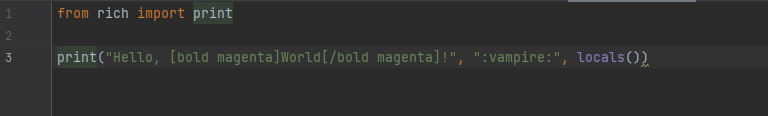

# rich_output 색깔 나오게 하기
## 단순히 붙여 놓으면 색깔이 나오지 않으므로 아래 내용을 따라 해야한다.

rich를 처음  사용한다면 rich밑에 빨간 줄이 뜬다. 다운받으면 된다.

하지만 다운받아도 색깔이 적용이 안될 것이다.    
이는 pycharm을 사용하기에 발생하는 문제이다. 

이 경우는 

맨 위 왼쪽을 보면 run을 누르면 Edit configuration을 누른다.

