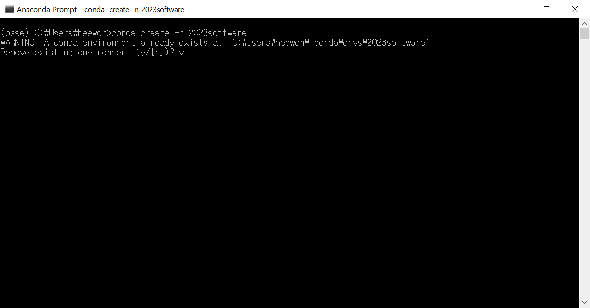
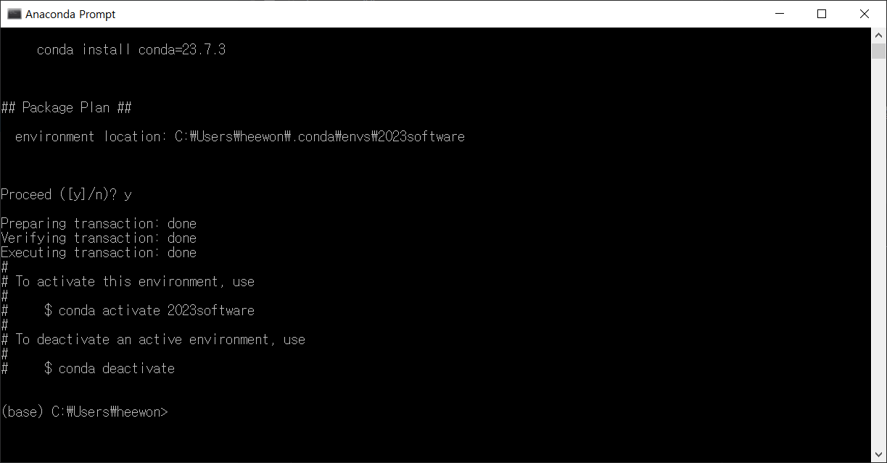
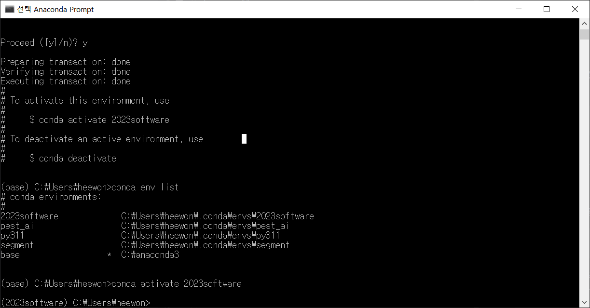
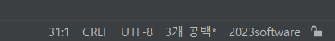

# 가상환경 구축하기
## 응소수업시간에 배운 가상환경을 구축해보자!!

1. anaconda promt를 실행한다.

2. 가상환경을 만든다.   

        conda create -n 가상환경이름(2023software)
3. 중간에 y/n이 나오면 y를 입력한다.   

본인은 이미 있기 때문에 짧지만 이것보다 길거다.

이렇게 뜨면 성공이다.

4. 가상환경 리스트를 출력하여 잘 되었는지 확인한다.

       conda env list

5. 가상환경 리스트에 방금만든 가상환경이 있다면 성공이다.

6. 가상환경을 활성화시키자.

       conda activate 2023software

이렇게 되면 성공이다.

이제 파이참을 열어 가상환경을 적용시켜보자!

   
파이참을 열면 오른쪽하단부에 이렇게 나와있는 부분을 찾을 수 있다.   
(2023software로 안되어 있을것이다. 이제 이렇게 바꿔야 한다.)

1. 2023software를 클릭한다.
2. 새 인터프리터 추가를 누른다. -> 로컬 인터프리터 추가
3. 이런 창이 뜨면 conda 환경으로 들어간다.

4. 방금 생성한 2023software를 적용한다! 
5. 끝~